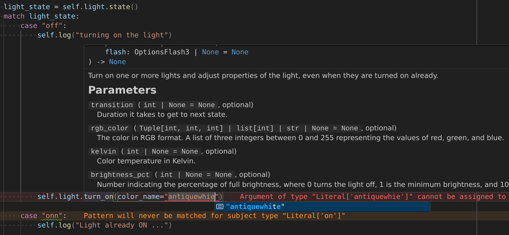

# Home Assistant Python typer <!-- omit in toc -->


Full-fledged typing for your home automation applications. Never see your automations break again.

Bring a real software development experience to your home automation.

### Table of contents

- [⏱️ What](#️-what)
- [💡 Why](#-why)
  - [🖱️ Nocode?](#️-nocode)
  - [👨‍💻 Code?](#-code)
  - [💡 So what?](#-so-what)
- [🚀 How it works](#-how-it-works)
  - [🔧 Installation](#-installation)
  - [🛡️ Repeatable read](#️-repeatable-read)
    - [Why it's useful](#why-its-useful)
    - [What to be careful about](#what-to-be-careful-about)
- [💬 Community \& Feedback](#-community--feedback)
- [📚 Diverse how-to s](#-diverse-how-to-s)
  - [Debugger](#debugger)
- [🔭 Vision](#-vision)
- [🧘 Inspirations](#-inspirations)

# ⏱️ What

Run this script to obtain a typed Python interface for all entities available in *your* Home Assistant, which can then be exported to your [AppDaemon](https://appdaemon.readthedocs.io/en/latest/) apps folder to enable writing your home automations in nicely typed Python.



See [How it works](#-how-it-works) section for how to setup.

# 💡 Why

## 🖱️ Nocode?

HomeAssistant is a largely no-code platform. This works well for very small automations. However as soon as there are many automations and they are more or less complex, they are a pain to maintain, and/or end up extensively using [Templating](https://www.home-assistant.io/docs/configuration/templating/).

e.g. [Advanced Heating Control](https://github.com/panhans/HomeAssistant/blob/04808964b7ba47c6ede42a90721c34e15a9eb820/blueprints/automation/panhans/advanced_heating_control.yaml#L1591-L3232)

And I regret to inform you that... this is not no-code. This is just code. And a terribly painful way to write it, because yaml+jinja is actually not a programming language.

Also if you make the slightest mistake, nothing will catch it until it fails to run the particular automation.

## 👨‍💻 Code?

<details>
<summary>Why code is better than no-code</summary>

Section title is a bit provocative, so:

DISCLAIMER: I acknowledge no-code may be faster to write very simple stuff, e.g. if someone presses the button, switch the light, or ring the bell. Anything that's basically a full use-case directly available as a single no-code box may be slightly easier with no-code. I also acknowledge that HomeAssistant's no-code platform is very powerful, and that it's amazingly good to have it for how accessible it makes it for people to start playing around with home automation.

What I want to underline here is how great of a tool *code* is for writing automations, how little harder it is to write code for simple cases, how much simpler it is to write code for hard cases, and how often cases actually end up being harder than they looked at first glance. So if you start getting invested in home automation, and you want to tackle non-trivial automations, you may be interested by what programming with actual code has to offer!

If you have some developing experience and have ever touched a no-code platform, it's probably going to quickly be very clear to you how no-code is always quickly limited and inefficient, and how you quickly end up spending more time working around the tool's limitations than you spend actually writing automation logic. Otherwise, this section is for you.

With no-code tooling:

1. Anything that's not a directly supported use-case is either extremely tedious to write, or uses the "poorly-typed-code™" box of the no-code platform (for HA, [Templates](https://www.home-assistant.io/integrations/template/)) which is also tedious, but also is code (just more tedious and harder to maintain than it should be).

2. No-code lacks version control. If you want to quickly revert a part of your changes, you need to remember what it was like before and revert by hand. With code, you can write your new version, test it directly on your computer (saving the file will reload the app immediately), and when you're ready, send it to a permanent state with a single command. (In my case, `git commit`, which also incidentally is the best way to store software version history.)

3. No code lacks variables and functions, so you repeat the same boxes (or almost the same boxes) multiple times. If you need to make ~ the same changes to multiple automations, it will take you many clicks per automation, whereas with code, factoring is not 50 clicks, so you've probably just already written a function, so you can probably just change that one function. Otherwise a "search in all files" will get you sorted in seconds.

4. No-code lacks typing. If an entity becomes unavailable, or changes name, or you don't pass the right entity to a bluebrint, automations break, but noone will warn you. You only notice it when something doesn't work as expected, and then you spend a lot of time diagnosing why. With code, your editor immediately gives you a big red line in case of mistake, so that doesn't take any time.

5. When you write no-code, you're actually already using 90% of the skills of a developer who writes programs using code:
   - Thinking about how to solve the problem on a high level (I want this to happen if this happens)
   - Thinking about what triggers automations
   - Thinking about how to turn that into a set of conditions and actions (if/else...)
   - Pointing to entities and actions to take on them
   
   Compared to all these skills you need anyway to program using a no-code platform, writing python code just requires knowing [a 2-minute-read syntax](https://awangt.medium.com/python-in-2-minute-read-16984bea892f).

[A longer video explanation](https://youtu.be/uxBZFju0Mjs&t=104).

Code solves all the aforementioned pain points.

In the "automate things with a computer" world, besides very specialized tasks, actual code is the most efficient way we know to automate things in a flexible manner today today.

That is in great part because the software industry is so big that it has developed over the years amazing tools to make that development experience absolutely seamless!

Side note: If you don't already use it, learn `git` by using a graphical git client, e.g. VSCode + Git Graph extension, or SmartGit (or both), to understand the concepts well, and store your code on there. It's easier than you think, and that way every version of your code is saved. Never fear to break stuff!
</details>

Now [AppDaemon](https://appdaemon.readthedocs.io/en/latest/) was built to address this problem: to allow expressing automations in an actual programming language (Python) rather than Yaml+Jinja, when they get complex (or when you find writing lines of code simpler than clicking left and right in dropdowns - after all, variables are a useful concept...)

Unfortunately it has its shortcomings: namely you lose the nice auto-completion that you get from the UI, where all your entities and actions you can take on them are easily accessible.
Instead you have to enter entity IDs as strings, and hope that whatever function you're calling on them actually exists. In addition, most of home assistant's automations don't pre-exist in the API, so you'll also have to call them by their string names.

Again, if you make mistakes, if you lose devices on the network, or refer non-existing properties, nothing will catch it until you try to run them.

## 💡 So what?

We're solving AppDaemon's pain point. We introduce a fully typed API, usable within your favorite Python code editor with fully-fledged auto-completion and typing, that contains all your entities, and all functions you can call on available entities.

# 🚀 How it works

We provide a script which when run on a HomeAssistant instance will generate type definitions for all entities connected to the platform.

Run the the script to generate your types :
```console
cd /addon_configs/a0d7b954_appdaemon/homeassistant_python_typer/src && git pull && \
python3 -m homeassistant_python_typer /addon_configs/a0d7b954_appdaemon/apps/hapt.py && cp ../homeassistant_python_typer_helpers.py /addon_configs/a0d7b954_appdaemon/apps/
```

(Command to be [adapted](./INSTALL.md#%EF%B8%8F-running-directly-on-your-computer) if not running directly within a HomeAssistant Addon.)

This enables you to use your entities like so:

```python
import appdaemon.plugins.hass.hassapi as hass
from hapt import HomeAssistant

class SensorLight(hass.Hass):
    def initialize(self):
        self.ha = HomeAssistant(self)
        self.light = self.ha.light.hallway_light # typechecks & autocompletes
        self.sensor = self.ha.binary_sensor.hallway_motion_sensor_occupancy

        self.sensor.listen_state(self.on_motion_detected, new="on")

    def on_motion_detected(self):
        self.light.turn_on(
            # This typechecks:
            # - Whether the `color_name` parameter exists (auto-completed)
            # - Whether HomeAssistant knows about this particular color name (auto-completed)
            # - And even whether RGB support is available for your particular lightbulb!
            color_name="lavenderblush",

            # Alternatively (not both at the same time of course):
            # Again this typechecks that your lightbulb supports RGB
            rgb_color="#6F2DA8",

            brightness=255
        )
```

where with an [appropriately configured editor](./INSTALL.md#-editor):
- If you were to typo the name of the light, you'd get a nice big red error message stating that this light doesn't exist in your Home Assistant
- If your light were to not support RGB because it's a light where only the temperature and brightness can be configured, you'd get a nice big red error message stating that `rgb_color` is not available for `hallway_light`'s `turn_on`.
- Wherever you would get a dropdown in HomeAssistant's no-code editor, you'll get auto-completion and type checking for all possible input values for the parameter.
- All functions and function parameters are documented (with the same documentation as in the no-code UI)
- Every function available in Home Assistant is available (because they are introspected by the same API as HomeAssistant uses for its no-code interface)

## 🔧 Installation

**Detailed procedure:** See [Install guide](./INSTALL.md).

**TL;DR:**
1. Git clone
2. Run script as described above (with `HOMEASSISTANT_URL` & `HOMEASSISTANT_TOKEN` env vars if running locally)
3. Pick venv with appdaemon installed in VSCode (w. Pylance/BasedPyright extension)
4. Symlink `pyrightconfig_recommended.jsonc` of this project to `/pyrightconfig.json` of your appdaemon apps workspace
5. Enable `"python.analysis.diagnosticMode": "workspace"` in VSCode (or `basedpyright.analysis.diagnosticMode` if using BasedPyright)

## 🛡️ Repeatable read

The types provided by this project have a repeatable-read layer on the `state()` of entities.

What this means is, when you read the state of the same entity twice in the same event handling, you are guaranteed to get the same result, avoiding cases where an entity's state would change in the middle of handling an event, which could otherwise potentially lead to insidious race bugs.

### Why it's useful

This is useful for example if you consider [the `sensor_lights` example](https://github.com/Ten0/homeassistant_python_typer/blob/40e518daaced8342c46dc5dbdd0c4d257910069e/examples/sensor_lights.py#L47-L56):

In this example, we turn on when the sensor is on (there is presence), set a timer when the sensor is off (no presence) but light is on, and turn off when there is no presence nor timer set.

```python
    def check_sensor(self):
        if self.sensor.is_on() or self.light.is_off():
            self.clear_timer()
        else:
            # light is on but sensor is off
            self.set_timer()
        self.set_light()

    def set_light(self):
        should_be_on = self.sensor.is_on() or self.timer is not None
        # ...
```

Without repeatable read guarantees, there would be this insidious race bug:
- When checking sensor in `check_sensor` we may clear the timer because someone is under the sensor right now
- However when checking sensor again in `set_light`, just after clearing the timer, it might have just changed to "nobody is under the sensor" in the time it took for us to clear the timer, so we instantly reach the state where `not sensor.is_on()`, and no timer, so we instantly turn off, bypassing the intended timer!

Such insidious bugs are prevented by this repeatable read feature, provided in the spirit of further improving home automation reliability: `sensor.is_on()` cannot change value during event handling, so such logic will *always* work without need for special attention.

### What to be careful about

The downside of this is that for correctness, it's required to manually clear the state cache (`self.ha.hapt.clear_caches()`) **if using native appdaemon callbacks**. [Example](https://github.com/Ten0/homeassistant_python_typer/blob/be354da32c4a7c6f0911058943fc40c6fb860cd4/examples/thermostat.py#L75-L78).

This is important because if forgotten, one may be reading the previous entities states when handling a new event.

Typed listen_state APIs provided by `homeassistant_python_typer` already clear the caches as they receive an event, so they don't have this quirk.

Despite this downside, it is estimated to be a better compromise than not having this feature because assuming that you ultimately want your automations to always work, it easier to not forget this than to consider all potential subtle races such as the one described above.

Ultimately this project will probably either find a way to identify event handling jumps automatically to clear caches automatically, or provide overlays for more appdaemon APIs that would also perform implicit cache clearing where appropriate.

# 💬 Community & Feedback

This project is in its early stages, so the documentation might not be perfect yet.

If you have even the simplest question, or ideas, please open a [Discussion](https://github.com/Ten0/homeassistant_python_typer/discussions/categories/q-a) so we can improve!

If you find bugs (missing functions, incorrect types, `Any` types where useful to have more precise types, crashes...) please open an [issue](https://github.com/Ten0/homeassistant_python_typer/issues).

# 📚 Diverse how-to s

## Debugger

This documentation really belongs in AppDaemon's doc but I haven't found it there so...

With VSCode's debugger, and appdaemon installed in a python virtual env with pip and selected as Python interpreter in VSCode (which is necessary for typing to work in your IDE anyway):

```jsonc
// .vscode/launch.json
{
	"version": "0.2.0",
	"configurations": [
		{
			"name": "Debug Appdaemon & their apps",
			"type": "debugpy",
			"request": "launch",
			"module": "appdaemon",
			"args": [
				"-c",
				"absolute/path/to/folder/that/contains/appdaemon.yml", 
				// without appdaemon.yml at the end of the path, only point to the folder
			]
		}
	]
}
```

Then follow [the regular VSCode + Python debugger doc](https://code.visualstudio.com/docs/python/debugging).

# 🔭 Vision

Future ideas for this project:
1. Make it easy to link GitHub & HomeAssistant via an integration that can:

   a. Configure webhooks to automatically pull the code and restart AppDaemon when new updates to the automations are pushed, and sends back ✅ status check to github.
     - Right now I've got this setup for my own HomeAssistant but the setup is more difficult that one might like.

   b. Automatically introspect HomeAssistant and push `hapt.py` updates on your personal `git` repository automatically when entities or services are added/removed.

   c. Automatically flag failed builds ❌ on such commits if they remove entities or services that were needed by some automations, and allow plugging notification automations to tell home owner what broke.

2. Make sure it's easy to plug your own entities into automations distributed by others, while preserving typing ("automation libraries").

   It's not completely solved how to do this currently. Currently considered options:

   a. Introduce superclasses for common uses and distribute them as a `homeassistant_python_typer_helpers` library. "automation libraries" would depend on this and have their typechecking rely on these being implemented. Downside: this is heavy, and probably requires a lot of manual work.

   b. Don't put type annotations in libraries, and let type inference work out what concrete type we're attempting to run the library with. Downside: type inference only goes so far: if automation uses its own classes, it will end up with `Any` or `Unknown` in many places, which will prevent typechecking from checking anything.

   c. Do b. and advise library authors to use [Protocols](https://peps.python.org/pep-0544/). This may be better than a. for the reason that this allows locally extending the subclasses without having to change `hapt.py`. Downside: unless we provide a database of protocols (like a.) this will be very heavy for implementors. In addition because I don't know of a way to define a type alias for a type annotation that reads: "any type that implements this non-protocol class BUT also implements this protocol class" (trying to do this: `class RgbLight(hapth.OnOffState, Protocol)` gives `Protocol class "RgbLight" cannot derive from non-Protocol class "OnOffState"`) this probably means we need to dupplicate all of our classes as protocol classes to ease such declarations, which is both bothersome and worse typing.
    - Idea: we could automatically generate protocol classes for each conditional argument of a service. This makes defining protocols for arguments combinations reasonably doable.

   d. Recommend to library authors to put placeholders methods for actions (e.g. `turn_on_light` for a sensor lights app), where users would define an app that inherits the abstract app and overrides the appropriate methods with typed plugs to their own HomeAssistant entities. This may or may not be practically better than the Protocols approach.


3. Make it possible to easily bump "automation libraries" with typechecking (dependencies lockfiles and dependabot PRs, that can optionally auto-merge if typechecking passes?)

4. Improve typing on entities states and attributes ([currently supported](https://github.com/Ten0/homeassistant_python_typer/blob/a040adfc83ff17df899cfda6735eaa51f89d99d7/src/homeassistant_python_typer/states.py#L46): light/switch/... as `on`/`off`, counters/sensors/... as `int`/`int | float`, enums as string literals)

# 🧘 Inspirations

I (Ten0) am a core team member of [Diesel](https://diesel.rs/), the [#1](https://lib.rs/crates/diesel) library of the Rust ecosystem for doing precisely this (bringing native typechecking capabilities from introspection) for the general case of SQL databases.
